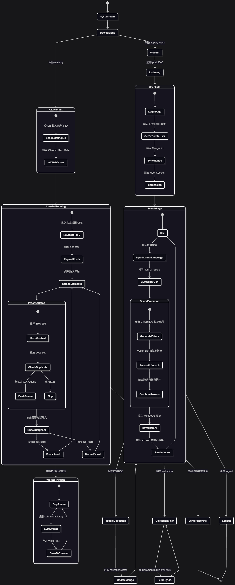

# 學生租屋系統 (Student Rental System)

## 系統概述

學生租屋系統是一個專為學生設計的租屋平台，旨在幫助學生更高效地找到符合需求的租屋資訊。系統主要功能包括：

1. **自動爬取 Facebook 租屋社團** 的房屋資訊
2. **自然語言處理技術** 將用戶查詢轉換為結構化條件
3. **智能搜尋** 透過 ChromaDB 向量資料庫進行高效查詢
4. **Web 介面** 提供用戶登入、搜尋房屋、管理收藏等功能
5. **搜尋歷史記錄** 保存用戶的查詢歷史
### State Machine Diagram


## 技術架構

### 前端
- **Flask** 作為 Web 框架
- **HTML/CSS/JavaScript** 提供用戶介面
- **Session 管理** 保持用戶登入狀態

### 後端服務
- **Selenium** 爬取 Facebook 租屋社團資料
- **ChromaDB** 向量資料庫儲存和查詢房屋資訊
- **MongoDB** 儲存用戶資料和搜尋歷史
- **LLM 服務** 將自然語言查詢轉換為結構化查詢

### 核心功能模組

1. **Facebook 租屋爬蟲**
   - 使用 Selenium 自動化瀏覽器操作
   - 從指定 Facebook 社團爬取租屋貼文
   - 使用 SHA-256 雜湊值去重複貼文

2. **查詢生成器**
   - 將用戶自然語言查詢轉換為結構化查詢條件
   - 範例：
     ```json
     {
       "search_text": "三房兩廳",
       "filters": {
         "$and": [
           {"city": {"$eq": "台南市"}},
           {"district": {"$eq": "東區"}},
           {"layout_room": {"$gte": 3}},
           {"layout_hall": {"$gte": 2}},
           {"can_cook": {"$eq": 1}},
           {"has_parking": {"$eq": 1}},
           {"price_max": {"$lte": 15000}}
         ]
       }
     }
     ```

3. **RAG 服務**
   - 使用 ChromaDB 進行向量搜尋
   - 支援絕對過濾條件（如不可養寵物）
   - 範例查詢：
     ```python
     result = rag_service.query(
         question="東區凱旋路",
         filters={"pet_allowed": False}
     )
     ```

4. **用戶管理**
   - 使用 MongoDB 儲存用戶資料
   - 記錄用戶搜尋歷史
   - 管理用戶收藏的房屋

## 安裝與設定

### 環境需求
- Python 3.11+
- MongoDB
- ChromaDB
- LLM 服務（如 Ollama）

### 安裝步驟

1. 克隆專案：
   ```bash
   git clone git@github.com:StudentRentalSystem/StudentRentalSystem-Python.git
   cd StudentRentalSystem-Python
   ```

2. 安裝依賴套件：
   ```bash
   pip install -r requirements.txt
   ```

3. 設定環境變數（`.env` 檔案）：
   ```
   FACEBOOK_GROUP_URL=您的Facebook租屋社團URL
   DB_URL=您的MongoDB連接字串
   LLM_CLIENT_TOKEN=您的LLM API金鑰
   LLM_SERVER_ADDRESS=LLM服務地址
   LLM_MODEL_TYPE=使用的LLM模型類型
   ```

4. 啟動服務：
   - Frontend
      ```bash
      python src.frontend.app.py
      ```
   - Crawler
      ```bash
     python src.facebook_rental_crawler.crawler <scroll_count>
     ```
## 使用說明

### 使用者流程
1. 登入系統（輸入電子郵件和姓名）
2. 在搜尋欄輸入自然語言查詢（如："我要找台南東區，三房兩廳，可開伙，有車位，預算1萬5以內"）
3. 系統會顯示符合條件的房屋列表
4. 可收藏感興趣的房屋
5. 查看搜尋歷史

### 系統指令
- `rental`：切換到租屋搜尋模式
- `others`：切換到一般聊天模式
- `exit`：退出系統

## 開發說明

### 核心程式碼結構

```
src/
├── facebook_rental_crawler/  # Facebook 租屋爬蟲
│   ├── crawler.py            # 爬蟲主程式
│   ├── crawler_config.py    # 爬蟲設定
│   └── prompts.py           # 資料處理提示
├── frontend/                # 前端介面
│   ├── app.py               # Flask 應用
│   ├── embedding_database.py # 資料庫查詢
│   └── user_service.py      # 用戶服務
├── query_generator/        # 查詢生成器
│   ├── main.py             # 主程式
│   ├── prompts.py          # 查詢提示
│   └── utils.py            # 工具函式
├── rag_service/           # RAG 服務
│   ├── client.py          # LLM 客戶端
│   ├── llm_config.py      # LLM 設定
│   └── main.py            # 主程式
└── utils.py               # 通用工具函式
```

### 開發注意事項

1. **Facebook 爬蟲**
   - 需要正確設定 Facebook 登入憑證
   - 爬取頻率需遵守社團規則
   - 使用 SHA-256 雜湊值去重複貼文

2. **查詢生成器**
   - 使用 LLM 將自然語言轉換為結構化查詢
   - 範例查詢格式需符合 ChromaDB 的查詢語法
   - 失敗時會回退到純文字搜尋

3. **RAG 服務**
   - 使用 ChromaDB 進行向量搜尋
   - 支援絕對過濾條件
   - 範例查詢需包含 `question` 和 `filters`

4. **錯誤處理**
   - 401/403 錯誤時會提示檢查 LLM_API_KEY
   - 爬蟲錯誤會記錄到日誌
   - 查詢生成失敗時會回退到純文字搜尋

## 參與貢獻

歡迎提交問題和 Pull Requests。請遵循以下貢獻指南：

1. Fork 專案
2. 建立功能分支 (`git checkout -b feature/新功能`)
3. 提交變更 (`git commit -am '新增某某功能'`)
4. 推送分支 (`git push origin feature/新功能`)
5. 建立 Pull Request

## 授權

本專案採用 [MIT 授權](LICENSE)。

## 聯絡方式

如有任何問題或建議，請聯絡專案維護者。
